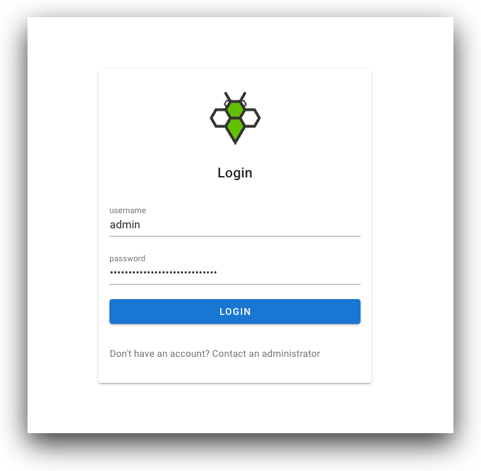
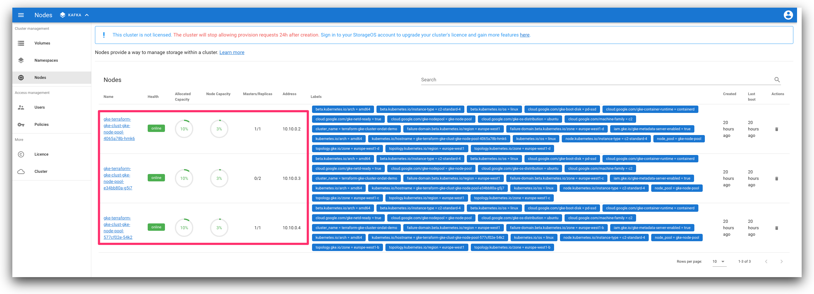
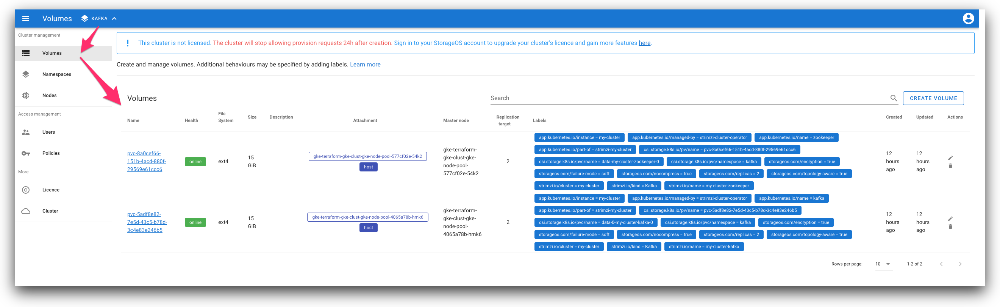
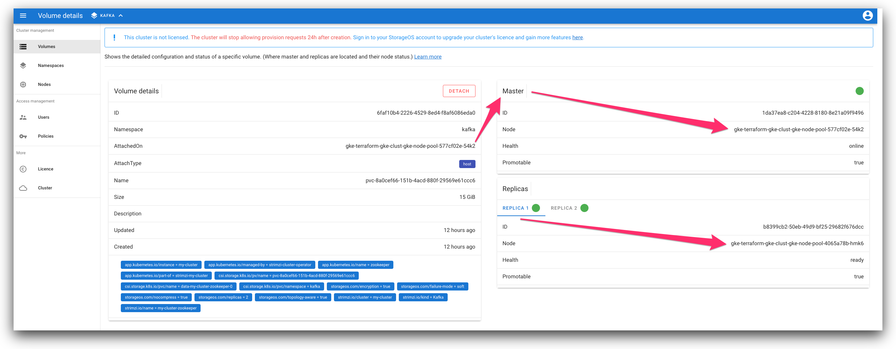
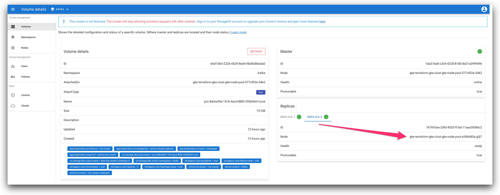

## Using Ondat

* Once the cluster has been successfully provisioned, we are going to achieve the following objectives;
  1. *Ensure that Ondat has been installed successfully into the cluster.*
  2. *Create a customised Ondat `StorageClass` and set it as the default `StorageClass` for the cluster. Ondat leverages [feature labels](https://docs.ondat.io/docs/reference/labels/) to enable key capabilities such as;*
     1. *[Encryption](https://docs.ondat.io/docs/operations/encryption/),*
     2. *[Replication](https://docs.ondat.io/docs/concepts/replication/),*
     3. *[Topology-Aware Placement (TAP)](https://docs.ondat.io/v2.5/docs/operations/tap/).*
  3. *Deploy an application that requires persistent storage, where the customised Ondat `StorageClass` created earlier will be used.*
  4. *Use Ondat's UI to review the status of the cluster and the volumes.*
  5. *Use Ondat's CLI to review the status of the cluster and the volumes.*
  6. *After you are finished testing, remove the workloads deployed on the cluster, uninstall Ondat and teardown the cluster you provisioned.*

1. Ensure that Ondat has been installed successfully into the cluster.

```bash
# if `terraform apply` was successful and there was no error reported,
# Ondat should have been installed onto the newly provisioned cluster.

# if the installation was not successful, check the version of 
# `kubectl-storageos`, ensure that it is in your path and run 
# preflight checks against the cluster to ensure that prerequisites 
# have been met for Ondat.
$ kubectl storageos version
$ kubectl storageos preflight

# if Ondat is not installed yet, execute the following command to install.
$ kubectl storageos install --include-etcd \
  --admin-username='admin' \
  --admin-password='ADD_YOUR_STRONG_PASSWORD_HERE'

# inspect Ondat's deployments.
$ kubectl get deployments --all-namespaces | grep "storageos"

NAMESPACE        NAME                                READY   UP-TO-DATE   AVAILABLE   AGE
storageos-etcd   storageos-etcd-controller-manager   1/1     1            1           4h53m
storageos-etcd   storageos-etcd-proxy                1/1     1            1           4h53m
storageos        storageos-api-manager               2/2     2            2           4h52m
storageos        storageos-csi-helper                1/1     1            1           4h52m
storageos        storageos-operator                  1/1     1            1           4h53m
storageos        storageos-scheduler                 1/1     1            1           4h52m

# inspect Ondat's daemonset.
$ kubectl get daemonset --all-namespaces | grep "storageos"

NAMESPACE     NAME                        DESIRED   CURRENT   READY   UP-TO-DATE   AVAILABLE   NODE SELECTOR                                                             AGE
storageos     storageos-node              3         3         3       3            3           <none>                                                                    4h56m

# inspect Ondat's pods.
$ kubectl get pods --all-namespaces | grep "storageos"

NAMESPACE        NAME                                                             READY   STATUS    RESTARTS   AGE
storageos-etcd   storageos-etcd-0-j4vmb                                           1/1     Running   0          4h58m
storageos-etcd   storageos-etcd-1-tv2p5                                           1/1     Running   0          4h58m
storageos-etcd   storageos-etcd-2-cdcm2                                           1/1     Running   0          4h58m
storageos-etcd   storageos-etcd-controller-manager-7c6df47dfb-rhng7               1/1     Running   0          4h59m
storageos-etcd   storageos-etcd-proxy-64cf4f6556-tfdcr                            1/1     Running   0          4h59m
storageos        storageos-api-manager-85c7c7ff79-7dkrg                           1/1     Running   0          4h57m
storageos        storageos-api-manager-85c7c7ff79-fzkv6                           1/1     Running   0          4h57m
storageos        storageos-csi-helper-65dc8ff9d8-rtqr4                            3/3     Running   0          4h57m
storageos        storageos-node-dvnn7                                             3/3     Running   0          4h58m
storageos        storageos-node-gz65r                                             3/3     Running   0          4h58m
storageos        storageos-node-pgsnc                                             3/3     Running   0          4h58m
storageos        storageos-operator-8f999cf4b-5xnvf                               2/2     Running   0          4h59m
storageos        storageos-scheduler-75dc6b5f56-5vdpt                             1/1     Running   0          4h58m

# inspect Ondat's StorageClass.
$ kubectl get storageclasses | grep "storageos"

NAME        PROVISIONER         RECLAIMPOLICY   VOLUMEBINDINGMODE   ALLOWVOLUMEEXPANSION   AGE
storageos   csi.storageos.com   Delete          Immediate           true                   6h4m
```

2. Create a customised Ondat `StorageClass` and set it as the default `StorageClass` for the cluster. Ondat leverages [feature labels](https://docs.ondat.io/docs/reference/labels/) to enable key capabilities such as;
   1. [Encryption](https://docs.ondat.io/docs/operations/encryption/),
   2. [Replication](https://docs.ondat.io/docs/concepts/replication/),
   3. [Topology-Aware Placement (TAP)](https://docs.ondat.io/docs/operations/tap/).

```bash

# navigate into the `ondat/storage-classes/` directory.
$ cd ../ondat/storage-classes/

# inspect the custom Ondat StorageClass with the feature labels.
$ cat v2-storage-class-ondat-encryption-replication-topology-aware-placement.yaml

# create the custom Ondat StorageClass.
$ kubectl apply -f v2-storage-class-ondat-encryption-replication-topology-aware-placement.yaml

# mark the `standard` StorageClass (or equivalent) as non-default - [false].
$ kubectl patch storageclass default -p '{"metadata": {"annotations":{"storageclass.kubernetes.io/is-default-class":"false"}}}'

# mark the custom Ondat StorageClass as default - [true].
$ kubectl patch storageclass ondat-encryption-replication-topology-aware-placement -p '{"metadata": {"annotations":{"storageclass.kubernetes.io/is-default-class":"true"}}}'

# inspect Ondat's StorageClass and ensure it's now the default.
$ kubectl get storageclasses | grep "storageos"

NAME                                                              PROVISIONER             RECLAIMPOLICY   VOLUMEBINDINGMODE      ALLOWVOLUMEEXPANSION   AGE
ondat-encryption-replication-topology-aware-placement (default)   csi.storageos.com       Delete          Immediate              true                   15m
storageos                                                         csi.storageos.com       Delete          Immediate              true                   6h31m
```

3. Deploy an application that requires persistent storage, where the customised Ondat `StorageClass` created earlier will be used.

```bash
# navigate into the `usecases/strimzi/` directory.
$ cd ../../usecases/strimzi/

# deploy Strimzi - Apache Kafka on Kubernetes - https://strimzi.io/quickstarts/.
$ kubectl create namespace kafka
$ kubectl create --filename='https://strimzi.io/install/latest?namespace=kafka' --namespace=kafka

# inspect the modified Strimzi custom resource before deploying.
$ cat kafka-persistent-single-ondat.yaml

# create the custom resource.
$ kubectl apply --filename=usecases/strimzi/kafka-persistent-single-ondat.yaml

# inspect Strimzi workloads.  
$ kubectl get pods --namespace=kafka

NAME                                          READY   STATUS    RESTARTS   AGE
my-cluster-entity-operator-6b495ccbc5-rnk5k   3/3     Running   0          3m4s
my-cluster-kafka-0                            1/1     Running   0          3m39s
my-cluster-zookeeper-0                        1/1     Running   0          4m23s
strimzi-cluster-operator-85bb4c6-fx2fp        1/1     Running   0          29m

# generate some random text by sending and receiving messages with Kafka.
# you can use https://www.lipsum.com/ or generate your own text.

# run a Kafka producer to send messages;
$ kubectl --namespace=kafka run kafka-producer \
  -ti \
  --image=quay.io/strimzi/kafka:0.26.0-kafka-3.0.0 \
  --rm=true \
  --restart=Never \
  -- bin/kafka-console-producer.sh \
  --broker-list=my-cluster-kafka-bootstrap:9092 \
  --topic=my-topic

# run a Kafka consumer to receive messages;
$ kubectl --namespace=kafka run kafka-consumer \
  -ti \
  --image=quay.io/strimzi/kafka:0.26.0-kafka-3.0.0 \
  --rm=true \
  --restart=Never \
  -- bin/kafka-console-consumer.sh \
  --bootstrap-server=my-cluster-kafka-bootstrap:9092 \
  --topic=my-topic \
  --from-beginning
```

4. Use Ondat's UI to review the status of the cluster and the volumes.

```bash
# use port forwarding to access Ondat's UI.
$ kubectl port-forward service/storageos 5705 --namespace=storageos

# login to Ondat's UI using your preferred browser.
http://localhost:5705/
```

<p align="center">
  
  
  
  
  
</p>

1. Use Ondat's CLI to review the status of the cluster and the volumes.

```bash
# check the version of `storageos` and ensure that it is in your path.
$ storageos version

# set the authentication and endpoint environment variables. 
$ export STORAGEOS_USERNAME="admin"
$ export STORAGEOS_PASSWORD="ADD_YOUR_STRONG_PASSWORD_HERE"
$ export STORAGEOS_ENDPOINTS="127.0.0.1:5705"
```

```bash
# inspect the cluster using the utility.
$ storageos describe cluster

ID:               8051787f-d0cd-4ec8-baef-2198caea95e3
Version:          Mg
Created at:       2021-11-27T20:01:09Z (20 hours ago)
Updated at:       2021-11-27T20:01:10Z (20 hours ago)
Telemetry:        Enabled
Crash Reporting:  Enabled
Version Check:    Enabled
Log Level:        info
Log Format:       json
Nodes:
  ID:             4bf16b26-ee58-47ec-9e86-cdbe63b4a858
  Name:           gke-terraform-gke-clust-gke-node-pool-e34bb80a-...
  Health:         online
  Address:        10.10.0.3:5703

  ID:             3f50fb9f-3f6c-45b9-acea-18e4b49484d0
  Name:           gke-terraform-gke-clust-gke-node-pool-4065a78b-...
  Health:         online
  Address:        10.10.0.2:5703

  ID:             6064dc4c-f17c-4d9b-9ffa-5e52e027cf0a
  Name:           gke-terraform-gke-clust-gke-node-pool-577cf02e-...
  Health:         online
  Address:        10.10.0.4:5703
```

```bash
# show details of the available nodes.
$ storageos describe nodes

ID                         6064dc4c-f17c-4d9b-9ffa-5e52e027cf0a
Name                       gke-terraform-gke-clust-gke-node-pool-577cf02e-54k2
Health                     online
Addresses:
  Data Transfer address    10.10.0.4:5703
  Gossip address           10.10.0.4:5711
  Supervisor address       10.10.0.4:5704
  Clustering address       10.10.0.4:5710
Labels                     beta.kubernetes.io/arch=amd64,
                           beta.kubernetes.io/instance-type=c2-standard-4,
                           beta.kubernetes.io/os=linux,
                           cloud.google.com/gke-boot-disk=pd-ssd,
                           cloud.google.com/gke-container-runtime=containerd,
                           cloud.google.com/gke-netd-ready=true,
                           cloud.google.com/gke-nodepool=gke-node-pool,
                           cloud.google.com/gke-os-distribution=ubuntu,
                           cloud.google.com/machine-family=c2,
                           cluster_name=terraform-gke-cluster-ondat-demo,
                           failure-domain.beta.kubernetes.io/region=europe-west1,
                           failure-domain.beta.kubernetes.io/zone=europe-west1-b,
                           iam.gke.io/gke-metadata-server-enabled=true,
                           kubernetes.io/arch=amd64,
                           kubernetes.io/hostname=gke-terraform-gke-clust-gke-node-pool-577cf02e-54k2,
                           kubernetes.io/os=linux,
                           node.kubernetes.io/instance-type=c2-standard-4,
                           node_pool=gke-node-pool,
                           topology.gke.io/zone=europe-west1-b,
                           topology.kubernetes.io/region=europe-west1,
                           topology.kubernetes.io/zone=europe-west1-b
Created at                 2021-11-27T20:01:10Z (20 hours ago)
Updated at                 2021-11-27T20:01:37Z (20 hours ago)
Version                    MQ
Available capacity         291 GiB (8.1 GiB in use)

Local volume deployments:
  NAMESPACE                VOLUME                                                                       DEPLOYMENT ID                         HEALTH  TYPE     SIZE
  kafka                    pvc-8a0cef66-151b-4acd-880f-29569e61ccc6                                     1da37ea8-c204-4228-8180-8e21a09f9496  online  master   15 GiB
  kafka                    pvc-5adf8e82-7e5d-43c5-b78d-3c4e83e246b5                                     84c50075-70cb-4a51-8167-49983612a0be  ready   replica  15 GiB
# ... truncated output
```

```bash
# show details of the namespaces.
$ storageos describe namespaces

ID:          1454e028-51ca-4128-a15c-88f7787cffa2
Name:        kafka
Labels:      -
Version:     MA
Created at:  2021-11-28T02:53:36Z (13 hours ago)
Updated at:  2021-11-28T02:53:36Z (13 hours ago)

ID:          2318cc4b-a015-41e4-960d-5cca5daa5c45
Name:        default
Labels:      -
Version:     MA
Created at:  2021-11-27T20:01:09Z (20 hours ago)
Updated at:  2021-11-27T20:01:09Z (20 hours ago)
```

```bash
# get a list of the volumes in all of the namespaces.
$ storageos get volume --all-namespaces

NAMESPACE  NAME                                      SIZE    LOCATION                                            ATTACHED ON                                         REPLICAS  AGE
kafka      pvc-8a0cef66-151b-4acd-880f-29569e61ccc6  15 GiB  gke-terraform-gke-clust-gke-node-pool-577cf02e-...  gke-terraform-gke-clust-gke-node-pool-577cf02e-...  2/2       13 hours ago
kafka      pvc-5adf8e82-7e5d-43c5-b78d-3c4e83e246b5  15 GiB  gke-terraform-gke-clust-gke-node-pool-4065a78b-...  gke-terraform-gke-clust-gke-node-pool-4065a78b-...  2/2       13 hours ago
```

```bash
# show details of the volumes in all of the namespaces.
$ storageos describe volume --all-namespaces

ID                  6faf10b4-2226-4529-8ed4-f8af6086eda0
Name                pvc-8a0cef66-151b-4acd-880f-29569e61ccc6
Description
AttachedOn          gke-terraform-gke-clust-gke-node-pool-577cf02e-54k2 (6064dc4c-f17c-4d9b-9ffa-5e52e027cf0a)
Attachment Type     host
NFS
  Service Endpoint
  Exports:
Namespace           kafka (1454e028-51ca-4128-a15c-88f7787cffa2)
Labels              app.kubernetes.io/instance=my-cluster,
                    app.kubernetes.io/managed-by=strimzi-cluster-operator,
                    app.kubernetes.io/name=zookeeper,
                    app.kubernetes.io/part-of=strimzi-my-cluster,
                    csi.storage.k8s.io/pv/name=pvc-8a0cef66-151b-4acd-880f-29569e61ccc6,
                    csi.storage.k8s.io/pvc/name=data-my-cluster-zookeeper-0,
                    csi.storage.k8s.io/pvc/namespace=kafka,
                    storageos.com/encryption=true,
                    storageos.com/failure-mode=soft,
                    storageos.com/nocompress=true,
                    storageos.com/replicas=2,
                    storageos.com/topology-aware=true,
                    strimzi.io/cluster=my-cluster,
                    strimzi.io/kind=Kafka,
                    strimzi.io/name=my-cluster-zookeeper
Filesystem          ext4
Size                15 GiB (16106127360 bytes)
Version             Mw
Created at          2021-11-28T03:09:00Z (13 hours ago)
Updated at          2021-11-28T03:09:02Z (13 hours ago)

Master:
  ID                1da37ea8-c204-4228-8180-8e21a09f9496
  Node              gke-terraform-gke-clust-gke-node-pool-577cf02e-54k2 (6064dc4c-f17c-4d9b-9ffa-5e52e027cf0a)
  Health            online

Replicas:
  ID                b8399cb2-50eb-49d9-bf25-29682f676dcc
  Node              gke-terraform-gke-clust-gke-node-pool-4065a78b-hmk6 (3f50fb9f-3f6c-45b9-acea-18e4b49484d0)
  Health            ready
  Promotable        true

  ID                767692ea-2dfd-4033-97ed-11aac0f08dc2
  Node              gke-terraform-gke-clust-gke-node-pool-e34bb80a-g5j7 (4bf16b26-ee58-47ec-9e86-cdbe63b4a858)
  Health            ready
  Promotable        true
# ... truncated output
```

```bash
# to take a closer look at the volume(s) mounted to a node, use 
# `kubectl debug` and temporarily run a privileged container on a node.
$ kubectl debug node/gke-terraform-gke-clust-gke-node-pool-577cf02e-54k2 \
  -it \
  --image=ubuntu:latest

Creating debugging pod node-debugger-gke-terraform-gke-clust-gke-node-pool-577cf02e-54k2-ldrrz with container debugger on node gke-terraform-gke-clust-gke-node-pool-577cf02e-54k2.
If you don't see a command prompt, try pressing enter.
root@gke-terraform-gke-clust-gke-node-pool-577cf02e-54k2:/#
```

```bash
# through the privileged container, update the repository index and install `tree`.
$ apt update && apt install tree

# use `df` to show mounted filesystems.
$ df -h | grep "storageos"

Filesystem                                                         Size  Used Avail Use% Mounted on
/var/lib/storageos/volumes/v.6faf10b4-2226-4529-8ed4-f8af6086eda0   15G   41M   14G   1% /host/var/lib/kubelet/pods/4f8794f4-6622-482b-ab65-7e40bcec4c0c/volumes/kubernetes.io~csi/pvc-8a0cef66-151b-4acd-880f-29569e61ccc6/mount
storageos                                                          4.0K     0  4.0K   0% /host/var/lib/storageos/volumes
```

```bash
# navigate to where data is being stored on the node and list the files.
$ cd /host/var/lib/storageos/
$ ls -lah

total 41K
drwxr-xr-x  8 root root 4.0K Nov 27 20:01 .
drwxr-xr-x 41 root root 4.0K Nov 27 20:00 ..
-rw-------  1 root root 1.5K Nov 27 20:01 config.json
drwx------  3 root root 4.0K Nov 27 20:01 crashes
drwxr-xr-x  5 root root 4.0K Nov 28 03:09 data
drwxr--r--  2 root root 4.0K Nov 27 20:01 logs
drwx------  2 root root 4.0K Nov 27 20:01 nfs
drwx------  2 root root 4.0K Nov 28 03:09 state
-rw-------  1 root root 1.7K Nov 27 20:01 storageos-node-cert.crt
-rw-------  1 root root 1.3K Nov 27 20:01 storageos-node-key.pem
drwxr-xr-x  2 root root 4.0K May 29  2015 volumes
```

```bash
# display the directory in a tree-like layout.
$ tree

.
|-- config.json
|-- crashes
|   `-- dataplane
|-- data
|   |-- 155092-volume_metadata_.json
|   |-- 220630-volume_metadata_.json
|   |-- db1
|   |   |-- 000007.sst
|   |   |-- 000011.log
|   |   |-- 000012.sst
|   |   |-- 000015.log
|   |   |-- 000016.sst
|   |   |-- CURRENT
|   |   |-- IDENTITY
|   |   |-- LOCK
|   |   |-- LOG
|   |   |-- LOG.old.1638061871288786
|   |   |-- LOG.old.1638072671295153
|   |   |-- LOG.old.1638078671298990
|   |   |-- LOG.old.1638084671302828
|   |   |-- LOG.old.1638090671306731
|   |   |-- LOG.old.1638096671310765
|   |   |-- LOG.old.1638102671314621
|   |   |-- LOG.old.1638108671318633
|   |   |-- LOG.old.1638114671323031
|   |   |-- MANIFEST-000008
|   |   |-- OPTIONS-000010
|   |   `-- OPTIONS-000014
|   |-- db_metadata.json
|   |-- dev1
|   |   |-- vol.155092.0.blob
|   |   |-- vol.155092.1.blob
|   |   |-- vol.220630.0.blob
|   |   `-- vol.220630.1.blob
|   `-- idmap
|       |-- 000003.log
|       |-- CURRENT
|       |-- IDENTITY
|       |-- LOCK
|       |-- LOG
|       |-- MANIFEST-000001
|       `-- OPTIONS-000005
|-- logs
|   `-- storageos.log
|-- nfs
|-- state
|   |-- d.84c50075-70cb-4a51-8167-49983612a0be.json
|   `-- v.6faf10b4-2226-4529-8ed4-f8af6086eda0.json
|-- storageos-node-cert.crt
|-- storageos-node-key.pem
`-- volumes
    |-- d.1da37ea8-c204-4228-8180-8e21a09f9496
    |-- d.767692ea-2dfd-4033-97ed-11aac0f08dc2
    |-- d.b8399cb2-50eb-49d9-bf25-29682f676dcc
    `-- v.6faf10b4-2226-4529-8ed4-f8af6086eda0

10 directories, 45 files
```

6. After you are finished testing, remove the workloads deployed on the cluster, uninstall Ondat and teardown the cluster you provisioned.

```bash
# bring down Strimzi's workload resources and namespace first.
kubectl delete --filename=kafka-persistent-single-ondat.yaml
kubectl delete --filename='https://strimzi.io/install/latest?namespace=kafka' --namespace=kafka
kubectl delete namespace kafka

# remove Ondat from the cluster.
kubectl storageos uninstall --include-etcd

# destroy the environment created with terraform once you 
# are finished testing out GKE & Ondat.
$ terraform destroy
```

### Acknowledgements

* [Debugging via a shell on the node - Kubernetes](https://kubernetes.io/docs/tasks/debug-application-cluster/debug-running-pod/#node-shell-session).
